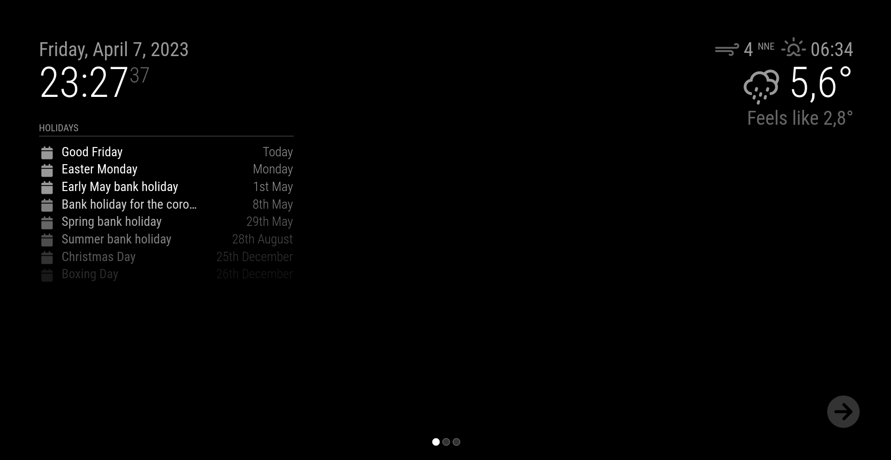

# MMM-Carousel with Slide Navigation

This is an extension to the [MagicMirror²](https://github.com/MichMich/MagicMirror) project, allowing the modules to be displayed in a rotating carousel instead of displaying all of them at once.

This version of the module was forked from [barnabycolby's MMM-Carousel](https://github.com/barnabycolby/MMM-Carousel).

Check out this screencast from @AgilesChroms to see how it looks: <https://www.youtube.com/watch?v=2WTgQLaAMQk>.

## Modes

There are three modes available:

- `'global'` ― All modules not cited in the `ignoreModules` config are rotated, displaying only one at a time for the duration of `transitionInterval`. This is particularly useful on small screens where there may not be enough space to display several components at once.
- `'positional'` ― Modules are grouped by `position` setting and rotated within a position except for modules listed in that position's `ignoreModules`, an `overrideTransitionInterval` can also be set to rotated different position at different speeds.
- `'slides'` ― groups of modules can be assigned to be displayed at the same time (regardless of `position`), an unlimited number of these "slide" groups can be set up. Module positions and appearances can also be changed for each slide.
  
  - Slide Indicators and Navigation Buttons can be enabled (see config settings)
  

## Additional features

- Modules can be moved to different positions and CSS classes applied to them for each slide.
- Multiple instances of a module can be used on different slides.
- Integration with [MMM-KeyBindings](https://github.com/shbatm/MMM-KeyBindings) for keyboard and bluetooth remote navigation.
- Rotational Home Page ― returns to a specified page on timeout

## Installation

Run these commands at the root of your MagicMirror² to install.

```shell
cd modules
git clone https://github.com/shbatm/MMM-Carousel
```

## Using the module

To use this module, add the following configuration block to the modules array in the `config/config.js` file:

```js
let config = {
  modules: [
    {
      module: "MMM-Carousel",
      position: "bottom_bar", // Required to draw in position
      config: {
        // See below for configurable options
      }
    }
  ]
};
```

Note that a `position` setting is required only if you want to show the page navigation icons and buttons.

### Configuration options

The following properties can be configured:

| Option                                                                                                                                                                            | Description                                                                                                                                                                                                                                                                                                                                                                                                                                                                                                                                                                                                                                                                                                                                                                                                                      |
| --------------------------------------------------------------------------------------------------------------------------------------------------------------------------------- | -------------------------------------------------------------------------------------------------------------------------------------------------------------------------------------------------------------------------------------------------------------------------------------------------------------------------------------------------------------------------------------------------------------------------------------------------------------------------------------------------------------------------------------------------------------------------------------------------------------------------------------------------------------------------------------------------------------------------------------------------------------------------------------------------------------------------------- |
| `mode`                                                                                                                                                                            | `global` ― All modules not cited in the `ignoreModules` config are rotated, displaying only one at a time for the duration of `transitionInterval`. This is particularly useful on small screens where there may not be enough space to display several components at once.<br>`positional` ― Modules are grouped by position setting and rotated within a position except for modules listed in that position's `ignoreModules`, an `overrideTransitionInterval` can also be set to rotated different position at different speeds.<br>`slides` ― groups of modules can be assigned to be displayed at the same time (regardless of position), an unlimited number of these "slide" groups can be set up.<br><br>This value is **OPTIONAL**<br>Possible values: `global` or `positional` or `slides`<br>Default value: `global` |
| `transitionInterval`                                                                                                                                                              | The number of milliseconds to display each module for.<br><br>This value is **OPTIONAL**<br>Possible values: Any valid int, passing 0 with mode:`"slides"` will disable the timer for manual navigation.<br>Default value: `10000`                                                                                                                                                                                                                                                                                                                                                                                                                                                                                                                                                                                               |
| `transitionTimeout`                                                                                                                                                               | Time, in milliseconds, before automatically returning to the home page. If a home page is not set, this returns to the first slide instead.<br><br>This value is **OPTIONAL** and is only valid when `transitionInterval` is disabled.<br>Default value: `0` (disabled)                                                                                                                                                                                                                                                                                                                                                                                                                                                                                                                                                          |
| `homeSlide`                                                                                                                                                                       | Which slide index/name is the home page. If none is set, this returns to the first slide instead.<br><br>This value is **OPTIONAL** and is only valid when `transitionInterval` is disabled.<br>Default value: `0`                                                                                                                                                                                                                                                                                                                                                                                                                                                                                                                                                                                                               |
| `slideTransitionSpeed`                                                                                                                                                            | The speed in milliseconds to fade in each module.<br><br>This value is **OPTIONAL**<br>Possible values: Any valid int<br>Default value: 1500 (ms)                                                                                                                                                                                                                                                                                                                                                                                                                                                                                                                                                                                                                                                                                |
| `ignoreModules`                                                                                                                                                                   | A list of module names whom should not be considered as part of the carousel. For example, the `alert` module should be able to display a notification at any time, by ignoring it we can prevent the plugin from hiding any notifications. NOTE: is only used in `global` and `slides` modes. Ignored modules in `slides` mode are shown on every slide.<br>This value is **OPTIONAL**<br>Possible values: String array<br>Default value: `[]`                                                                                                                                                                                                                                                                                                                                                                                  |
| `top_bar`<br>`top_left`<br>`top_center`<br>`top_right`<br>`upper_third`<br>`middle_center`<br>`lower_third`<br>`bottom_left`<br>`bottom_center`<br>`bottom_right`<br>`bottom_bar` | Determines if this position should be rotated and which modules in this position should be ignored. NOTE: is only used when mode is '`positional`' otherwise ignored.<br><br>This value is OPTIONAL<br>Possible values: `Object` with keys:<br>&nbsp;&nbsp;&nbsp;&nbsp;`enabled`, a `boolean` to rotate this position or not,<br>&nbsp;&nbsp;&nbsp;&nbsp;`ignoreModules`, a String array of modules names to ignore.<br>&nbsp;&nbsp;&nbsp;&nbsp;`overrideTransitionInterval`, a int a transition time for this position only.<br>Default value:<br>&nbsp;&nbsp;&nbsp;&nbsp;`{enabled: false, ignoreModules: [], overrideTransitionInterval: 10000}`                                                                                                                                                                              |
| `slides`                                                                                                                                                                          | See Examples below. The slides will be rotated as a complete set using the `transitionInterval` setting. Ingnored modules (ignoreModules) will be diplayed on all slides.<br><br>This value is **OPTIONAL**<br>Possible values: array of String/Object array (see below)<br>Default value: `[[]]`                                                                                                                                                                                                                                                                                                                                                                                                                                                                                                                                |
| `showPageIndicators`                                                                                                                                                              | A `boolean` true or false to show or hide the page indication 'bubbles' at the bottom of the screen. Default is `true`.                                                                                                                                                                                                                                                                                                                                                                                                                                                                                                                                                                                                                                                                                                          |
| `showPageControls`                                                                                                                                                                | A `boolean` true or false to show or hide the next and previous page buttons. Buttons will only appear when hovered near or over. They can be clicked when not visible. Default is `true`.                                                                                                                                                                                                                                                                                                                                                                                                                                                                                                                                                                                                                                       |
| `keyBindings`                                                                                                                                                                     | Key bindings to use for navigation with MMM-KeyBindings module. The values are the KeyNames to respond to from the `"KEYPRESS"` events generated in MMM-KeyBindings.<br><br>This value is **OPTIONAL**<br>Default value:<br><pre>keyBindings: {<br> enabled: true,<br> mode: "DEFAULT",<br> map: {<br>NextSlide:"ArrowRight",<br>PrevSlide:"ArrowLeft",<br>Pause: "ArrowDown",<br>Slide0:"Home"<br> }<br>}</pre><br>Note: any `Slide##` can be assigned to jump to a specific slide.                                                                                                                                                                                                                                                                                                                                             |
| `keyBindings.mode`                                                                                                                                                                | Mode Keyword for responding to key press events sent from MMM-KeyBindings. Default: `"DEFAULT"` which repsonds to any key press when no other module has taken focus or changed the keyword.                                                                                                                                                                                                                                                                                                                                                                                                                                                                                                                                                                                                                                     |

#### Example ― Global Carousel

```javascript
let config = {
  modules: [
    {
      module: "MMM-Carousel",
      config: {
        transitionInterval: 10000,
        ignoreModules: ["clock"],
        mode: "global"
      }
    }
  ]
};
```

#### Example ― Positional Carousel

```javascript
let config = {
  modules: [
    {
      module: "MMM-Carousel",
      config: {
        transitionInterval: 10000,
        ignoreModules: [],
        mode: "positional",
        top_left: {
          enabled: true,
          ignoreModules: [],
          overrideTransitionInterval: 15000
        },
        top_right: { enabled: true, ignoreModules: ["currentweather"] }
      }
    }
  ]
};
```

#### Example ― Slides Carousel

```javascript
let config = {
  modules: [
    {
      module: "MMM-Carousel",
      position: "bottom_bar", // Required only for navigation controls
      config: {
        transitionInterval: 10000,
        showPageIndicators: true,
        showPageControls: true,
        ignoreModules: ["clock", "alert"],
        mode: "slides",
        slides: {
          main: ["calendar", "compliments", "currentweather"],
          "Slide 2": [
            "weatherforecast",
            "MMM-Trello",
            "planetrise",
            "newsfeed"
          ],
          "Slide 3": ["MMM-fitbit"]
        }
      }
    }
  ]
};
```

#### Example ― Slides Carousel with [MMM-KeyBindings](https://github.com/shbatm/MMM-KeyBindings)

```javascript
let config = {
  modules: [
    {
      module: "MMM-Carousel",
      position: "bottom_bar", // Required only for navigation controls
      config: {
        transitionInterval: 10000,
        ignoreModules: ["clock", "alert"],
        mode: "slides",
        showPageIndicators: true,
        showPageControls: true,
        slides: {
          main: ["calendar", "compliments", "currentweather"],
          "Slide 2": [
            "weatherforecast",
            "MMM-Trello",
            "planetrise",
            "newsfeed"
          ],
          "Slide 3": ["MMM-fitbit"]
        },
        keyBindings: {
          enabled: true,
          map: {
            NextSlide: "ArrowRight",
            PrevSlide: "ArrowLeft",
            Pause: "ArrowDown",
            Slide0: "Home"
          },
          mode: "DEFAULT"
        }
      }
    }
  ]
};
```

#### <a name="advanced-slides"></a>Example ― Advanced Slides Carousel

The `slides` parameter can accept an array of both String or an Object of the form: `{ name: "ModuleName", position: "top_left", classes: "CSSclassName", carouselId: "1" }`.
Passing a config similar to the following shows a large clock on the first slide and then a small clock and additional modules on the second. `carouselId` is an optional parameter which can be used to set a unique identifier for multiple instances of a module. To use, set the same parameter in the module's `config` section.

```javascript
    mode: 'slides',
    slides: {
        Main: [   {name:'clock', classes:'zoom200', position:"middle_center", carouselId: "1"} ],
        "Slide 2: [   {name:'clock', classes:'', position:"top_left", carouselId: "2"},
            {name:'calendar', position:'top_left'},
            'MMM-WunderGround',
            'newsfeed'
        ]
    }
```

**Note:** The `zoomXXX` classes are available to change the scaling of a module. Using the methods above, you can pass `classes:'zoom%%%'` to scale a single module to a larger or smaller size. Supported zooms are 070%, 080%, 090%, 125%, 150%, 175%, and 200%. Pass `classes:''` for 100%. Edit your `'css/custom.css'` file to add additional classes.

## Navigation from other modules

You can navigate to different slides or transition points manually from other modules by sending a Module Notification:

|    Notification     | Action                                                                                                                                                                                                                                                                                                                       |
| :-----------------: | ---------------------------------------------------------------------------------------------------------------------------------------------------------------------------------------------------------------------------------------------------------------------------------------------------------------------------- |
|   `CAROUSEL_NEXT`   | Move to the next transition or slide.                                                                                                                                                                                                                                                                                        |
| `CAROUSEL_PREVIOUS` | Move back to the previous transition or slide.                                                                                                                                                                                                                                                                               |
|   `CAROUSEL_GOTO`   | Move to a given slide/tranistion index.<br>Pass a string or integer in the payload to go to a slide (e.g. `this.sendNotification("CAROUSEL_GOTO", "1")` will jump to the first slide). If you use named slides, you can also pass the slide name in an object (`this.sendNotification("CAROUSEL_GOTO", { slide: "Home" })`). |

### This module is compatable with MMM-Remote-Control's API (v2 or above)

- To see available actions, navigate to `http://magicmirrorip:8080/api/module/carousel`. You can then call the actions using curl or any other web browser/navigator:

```shell
curl -X GET http://magicmirrorip:8080/api/module/carousel/action
```

#### Example1 ― Recipe for MMM-AssistantMk2

```javascript
let recipe = {
  transcriptionHook: {
    MY_COMMAND_06: {
      pattern: "change mode",
      command: "MY_COMMAND_06_01"
    }
  },
  command: {
    MY_COMMAND_06_01: {
      notificationExec: {
        notification: "CAROUSEL_TOGGLE_SLIDE_MODE"
      }
    }
  }
};

exports.recipe = recipe; // Don't remove this line.
```

#### Example2 ― Recipe for MMM-AssistantMk2

```javascript
let recipe = {
  transcriptionHook: {
    MY_COMMAND_08: {
      pattern: "start carousel",
      command: "MY_COMMAND_08_01"
    }
  },
  command: {
    MY_COMMAND_08_01: {
      notificationExec: {
        notification: "CAROUSEL_START_SLIDE"
      }
    }
  }
};

exports.recipe = recipe; // Don't remove this line.
```

#### Example3 ― Recipe for MMM-AssistantMk2

```javascript
let recipe = {
  transcriptionHook: {
    MY_COMMAND_07: {
      pattern: "set time to (( |\\d+)+)",
      command: "MY_COMMAND_07_01"
    }
  },
  command: {
    MY_COMMAND_07_01: {
      notificationExec: {
        notification: "CAROUSEL_CHANGE_SLIDE_INTERVAL_TIME",
        payload: (pattern) => {
          return pattern[1];
        }
      }
    }
  }
};

exports.recipe = recipe; // Don't remove this line.
```
